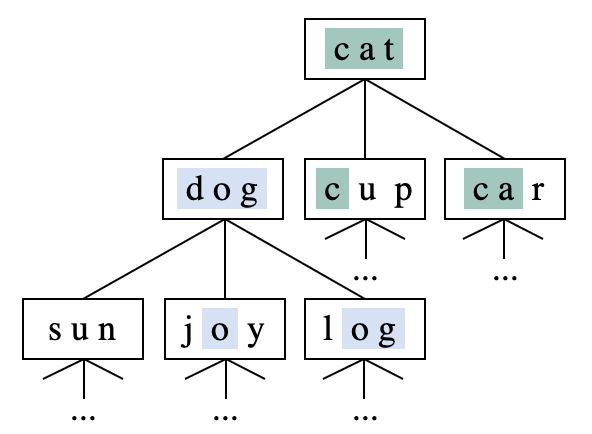

# Project - Longest Word

In this game, two players compete to find the longest word using randomly drawn letters (consonants and vowels).

## Game principle 

- The two players take turns to choose the number of vowels they wish to have in the letter draw.

- 10 letters are then drawn randomly.

- The goal is then to find the longest word possible using the drawn letters.
  

  #### Example 1

- RANDOMLY DRAWN LETTERS (Consonants & Vowels)

  - | **```C```** | **```O```** | **```E```** | **```T```** | **```G```** | **```O```** **```L```** | **```Y```** | **```H```** | **```N```** |

- LONGEST WORD(s) (Displaying one word)

  - | **```TECHNOLOGY```** | 10-Letter Word

  #### Example 2

- RANDOMLY DRAWN LETTERS (Consonants & Vowels)

  - | **```I```** | **```M```** | **```A```** | **```H```** | **```G```** | **```O```** **```T```** | **```T```** | **```L```** | **```R```** |

- LONGEST WORD(s) (Displaying one word)

  - | **```ALGORITHM```** | 9-Letter Word

## Assigned work - Part 1

The assigned work of Part 1 can be found [here](../part_1/README.md).


## Assigned work - Part 2

The aim of this second part is to integrate the search using a dictionary to find the longest word (or all the n-letter words).

To be efficient, we represent the dictionary containing n-letter words by a planar tree, such that:

- Each node in this tree has up to ```n``` children.
  
- The relationship between a node and its ```ith``` child (if it exists) in terms of letters is that they have ```(i - 1)``` identical character(s) (same letter, same position).

- Specifically, the relationship between a node and its children is as follows:

    - First child: 0 identical (in common) characters.
  
    - Second child: 1 identical character.

    - nth child: n - 1 identical characters.

  #### Illustrative example of a 3-letter dictionary/tree

<div style="text-align:center">
  
</div>


## Steps to follow

- Download a free “```.txt```” or “```.csv```” file/dictionary containing all English words.
  
    - You can pick the language of your choice (Arabic, English, French, etc.).
  
- Write the subprograms (functions) that use the provided files to create/load the dictionaries of n-letter words before starting the game (2 ≤ n ≤ 10).
  
- Write the subprograms that search for a word in these dictionaries.

- After finishing the game, you have to delete the created dynamic dictionaries.

